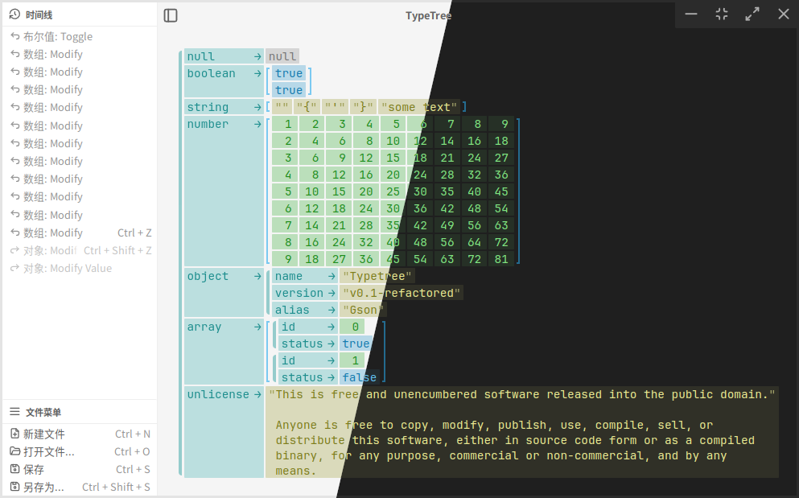

# TypeTree v0.2.0 (Gson)

用图形重新定义你的JSON数据

Redefine your JSON data with graphics

## 简介 Introduction

TypeTree的目标是为结构化数据提供高级的可视化编辑界面，目前的v0.2.x版的主要功能是JSON文件的编辑，代号为 Gson

你可以在[这里](https://mulam-dev.github.io/typetree/src/app.html)试试网页版本的编辑器（但是不能保存和打开文件）

The goal of TypeTree is to provide an advanced visual editing interface for structured data. The current v0.2.x version focuses on editing JSON files, codenamed Gson.

You can try the web version of the editor [here](https://mulam-dev.github.io/typetree/src/app.html) (saving and opening files are not supported).

## 界面 Interface

## 快捷键 Shortcuts

| 命令                   | 快捷键                                |
| -------------------- | ---------------------------------- |
| 移动光标                 | `↑/↓/←/→/W/S/A/D`                  |
| 选择节点的边（变为插入）         | `Ctrl + ↑/↓/←/→`                   |
| 移动选区（向某个方向扩大/缩小选择）   | `Shift + ↑/↓/←/→`                  |
| 移动到最上/下/左/右侧的节点      | `PageUp/PageDown/Home/End`         |
| 移动到最上/下/左/右边的边（变为插入） | `Ctrl + PageUp/PageDown/Home/End`  |
| 选取到最上/下/左/右侧         | `Shift + PageUp/PageDown/Home/End` |
| 全选                   | `Ctrl + A`                         |
| 进入节点内部/确认/修改/插入新节点   | `Enter`                            |
| 离开节点                 | `Esc`                              |
| 在右边插入新节点             | `Insert`                           |
| 在下边插入新节点             | `Shift + Insert/Enter`             |
| 删除左/右侧的节点            | `Backspace/Delete`                 |
| 删除上/下方的节点            | `Shift + Backspace/Delete`         |
| 插入新节点/变更当前节点类型       | `Tab`                              |
| 重组选区（包围）             | `(`                                |
| 快速插入：数组              | `[/V`                              |
| 快速插入：对象              | `{/H`                              |
| 快速插入：字符串             | `C`                                |
| 快速插入：数字              | `N/X`                              |
| 快速插入：布尔值             | `B`                                |
| 撤销                   | `Ctrl + Z`                         |
| 重做                   | `Ctrl + Shift + Z`                 |
| 新建文件                 | `Ctrl + N`                         |
| 打开文件                 | `Ctrl + O`                         |
| 保存                   | `Ctrl + S`                         |
| 另存为                  | `Ctrl + Shift + S`                 |

| Command                                                    | Shortcut                           |
| ---------------------------------------------------------- | ---------------------------------- |
| Move cursor                                                | `↑/↓/←/→/W/S/A/D`                  |
| Select node's edge (become insert)                         | `Ctrl + ↑/↓/←/→`                   |
| Move selection (expand/shrink selection in a direction)    | `Shift + ↑/↓/←/→`                  |
| Move to the top/bottom/left/rightmost node                 | `PageUp/PageDown/Home/End`         |
| Move to the top/bottom/left/rightmost edge (become insert) | `Ctrl + PageUp/PageDown/Home/End`  |
| Select to the top/bottom/left/rightmost                    | `Shift + PageUp/PageDown/Home/End` |
| Select all                                                 | `Ctrl + A`                         |
| Enter node/confirm/modify/insert new node                  | `Enter`                            |
| Leave node                                                 | `Esc`                              |
| Insert new node on the right                               | `Insert`                           |
| Insert new node below                                      | `Shift + Insert/Enter`             |
| Delete node on the left/right                              | `Backspace/Delete`                 |
| Delete node above/below                                    | `Shift + Backspace/Delete`         |
| Insert new node/change current node type                   | `Tab`                              |
| Restruct selection (surrond)                               | `(`                                |
| Quick insert: array                                        | `[/V`                              |
| Quick insert: object                                       | `{/H`                              |
| Quick insert: string                                       | `C`                                |
| Quick insert: number                                       | `N/X`                              |
| Quick insert: boolean                                      | `B`                                |
| Undo                                                       | `Ctrl + Z`                         |
| Redo                                                       | `Ctrl + Shift + Z`                 |
| New file                                                   | `Ctrl + N`                         |
| Open file                                                  | `Ctrl + O`                         |
| Save                                                       | `Ctrl + S`                         |
| Save as                                                    | `Ctrl + Shift + S`                 |
