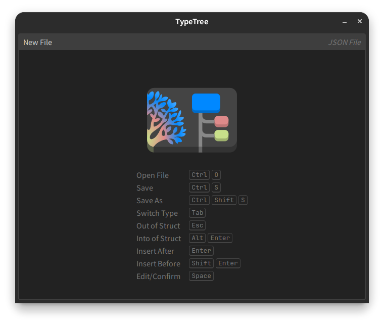

# TypeTree

一个用于处理树形结构数据的编辑器

## 简介

TypeTree的目标是为结构化数据提供高级的可视化编辑界面，目前支持编辑JSON数据

## 截图

## 快捷键

| Command      | Shortcut(s)                       |
| ------------ | --------------------------------- |
| Confirm      | Space                             |
| InsertAfter  | Enter                             |
| InsertBefore | Shift+Enter                       |
| InsertTo     | Ctrl+Enter                        |
| InsertInto   | Insert                            |
| InsertOutof  | Shift+Insert                      |
| Delete       | Delete, Backspace                 |
| Switch       | Tab                               |
| SwitchNext   | Tab                               |
| SwitchPrev   | Shift+Tab                         |
| Into         | Alt+Enter                         |
| Outof        | Escape                            |
| Up           | ArrowUp                           |
| Right        | ArrowRight                        |
| Down         | ArrowDown                         |
| Left         | ArrowLeft                         |
| Next         | ArrowDown, ArrowRight             |
| Prev         | ArrowUp, ArrowLeft                |
| SelectUp     | Shift+ArrowUp                     |
| SelectRight  | Shift+ArrowRight                  |
| SelectDown   | Shift+ArrowDown                   |
| SelectLeft   | Shift+ArrowLeft                   |
| SelectNext   | Shift+ArrowDown, Shift+ArrowRight |
| SelectPrev   | Shift+ArrowUp, Shift+ArrowLeft    |
| MoveUp       | Ctrl+ArrowUp                      |
| MoveRight    | Ctrl+ArrowRight                   |
| MoveDown     | Ctrl+ArrowDown                    |
| MoveLeft     | Ctrl+ArrowLeft                    |
| MoveNext     | Ctrl+ArrowDown, Ctrl+ArrowRight   |
| MovePrev     | Ctrl+ArrowTop, Ctrl+ArrowLeft     |
| ZoomIn       | Ctrl+Equal                        |
| ZoomOut      | Ctrl+Minus                        |
| Save         | Ctrl+KeyS                         |
| SaveAs       | Ctrl+Shift+KeyS                   |
| Open         | Ctrl+KeyO                         |